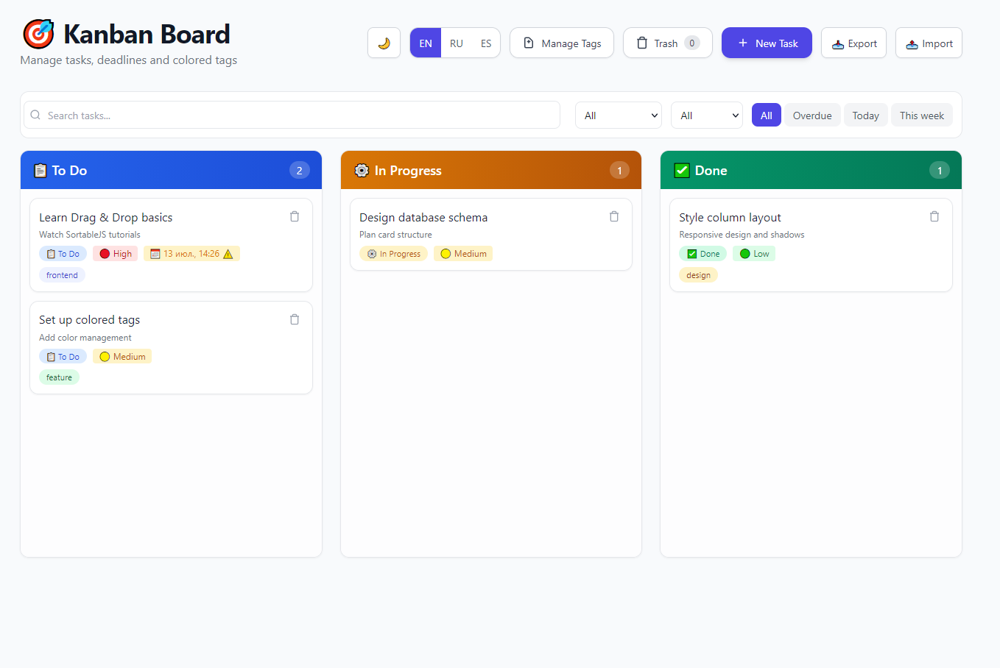
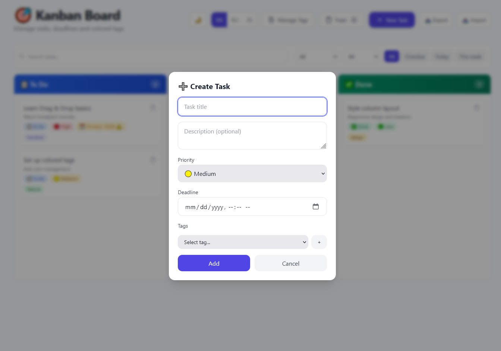
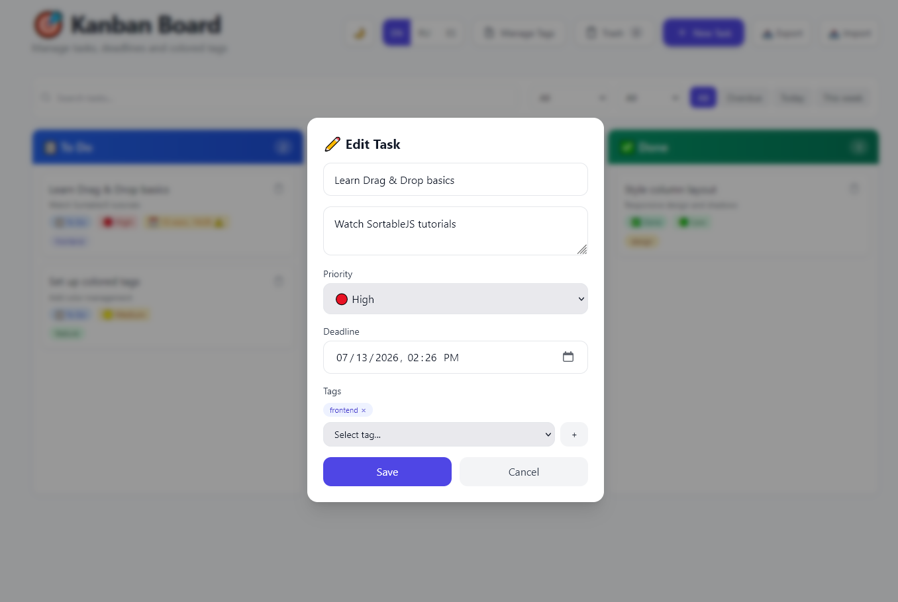
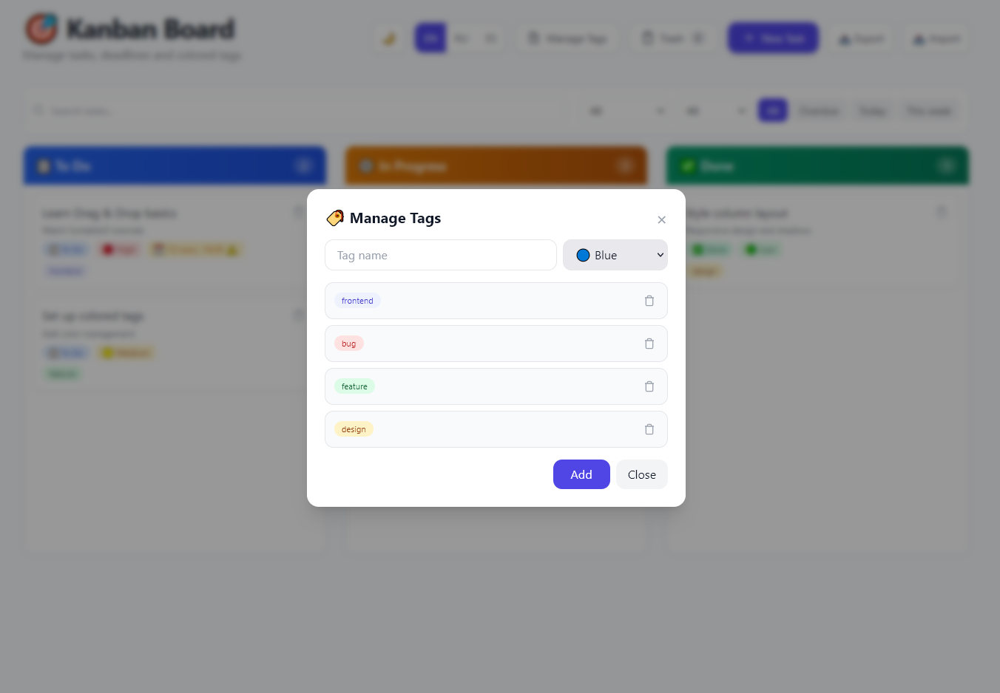
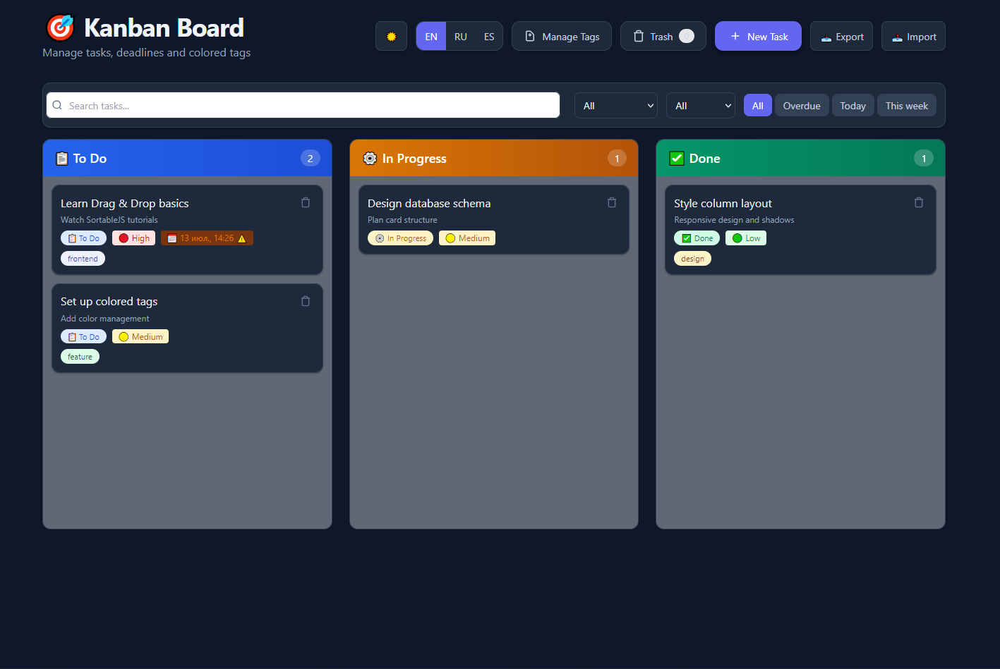
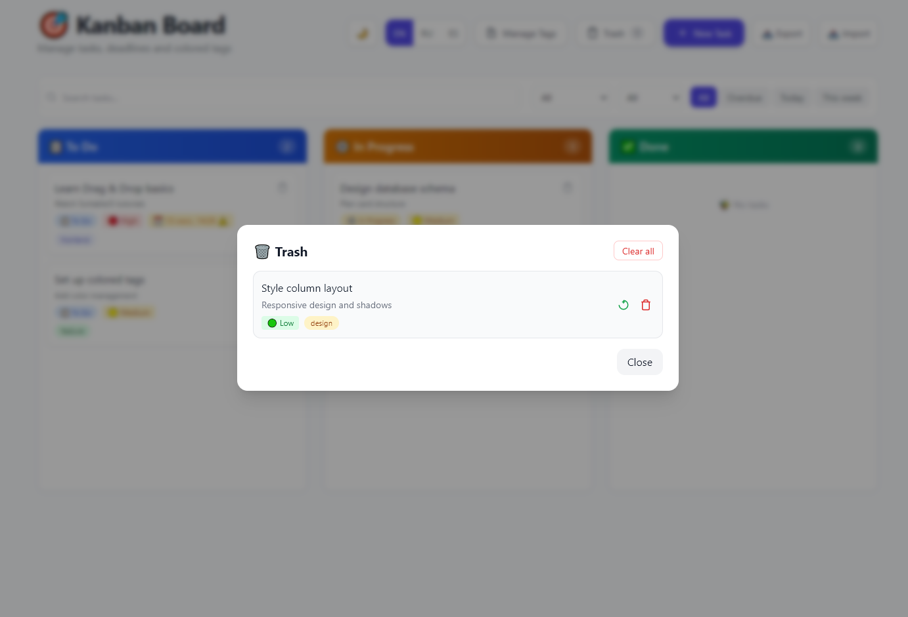

# 🎯 Kanban Board

A modern single-page web application for task management using the Kanban methodology. Full localization (EN / RU / ES), dark theme, keyboard shortcuts, and JSON import/export.

## ✨ Features

### 📋 Task Management
- Create, edit, and delete tasks
- Drag & Drop between columns
- Reorder cards within a column
- Soft delete with trash recovery
- **Undo last delete** (`Ctrl+Z`)

### 🎨 Three Task Statuses
- **To Do** — tasks waiting to start
- **In Progress** — active tasks
- **Done** — completed tasks

### ⚡ Priorities
- High 🔴 — red highlight
- Medium 🟡 — orange highlight
- Low 🟢 — green highlight

### 📅 Deadlines
- Set date and time for tasks
- Visual alerts for urgent tasks (less than 24 hours)
- Overdue task highlighting

### 🏷️ Tags
- Create and delete tags through the interface
- Choose from 10 tag colors
- Colors persist and display on all cards

### 🔍 Search & Filters
- Full-text search by title and description (debounced)
- Filter by priority, tag, and deadline (overdue / today / this week)
- Result counter: «Showing X of Y tasks»
- One-click «Clear filters» to reset

### 🌙 Dark Theme
- Toggle button in the toolbar (🌙 / ☀️)
- CSS variables system with smooth transitions
- Respects system preference (`prefers-color-scheme`)
- Persists choice in localStorage

### ⌨️ Keyboard Shortcuts
| Key | Action |
|-----|--------|
| `N` | New task |
| `Esc` | Close any modal |
| `Ctrl+Z` | Undo last delete |
| `F` | Focus search bar |
| `?` | Show shortcuts help |

### 📥 Export / Import
- Export all tasks and tags to `kanban-backup-*.json`
- Import from JSON with validation
- Merges tags (by name) and tasks (by ID) — no duplicates

### 🌐 Multi-language Support
- Language switcher in the toolbar (EN / RU / ES)
- 65+ translation keys per language
- Language preference saved in localStorage

### 🗑️ Trash
- Restore deleted tasks
- Permanently delete tasks
- Clear entire trash

### 💾 Data Persistence
- All data automatically saved to localStorage
- Board state fully restored on page reload
- Filter state resets on reload (intentional)

### 🛡️ Resilience
- Unique task IDs via `crypto.randomUUID()` — no collisions
- Offline banner when CDN resources fail to load
- Fallback CSS for Tailwind CDN outage

## 🛠️ Tech Stack

- **HTML5** — application markup
- **TailwindCSS** — styling and responsive design
- **JavaScript (vanilla)** — all business logic
- **SortableJS** — Drag & Drop implementation
- **LocalStorage** — data, theme, and language persistence
- **Google Fonts (Inter)** — typography

## 🚀 Getting Started

1. Download `index.html`
2. Open it in any modern browser
3. Ready to use — no dependencies or server required

## 📱 Responsive Design

Interface adapted for:
- Desktop computers
- Tablets
- Mobile devices

## 🎨 UI Highlights

- Modern minimalistic design
- Smooth animations and transitions
- Dark / light theme with system preference detection
- Visual feedback for all user actions
- Keyboard-driven workflow

## 📦 Data Structure

Each task card contains:
- Unique identifier (UUID)
- Task title
- Description (optional)
- Status (column)
- Priority
- Deadline (optional)
- Tags array
- Creation date
- Deletion flag

## ⭐ Support

If you find this project useful, please consider giving it a star on GitHub — it helps others discover it and motivates further development.

---
